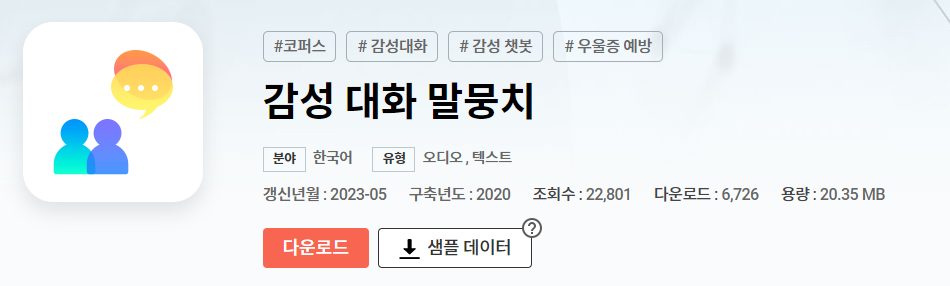
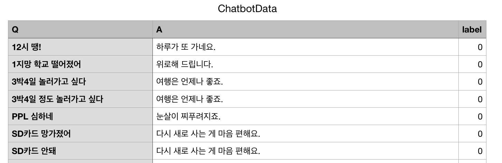

# SoDam 다이어리 **KoBert**, **SBert**, **ChatGPT** 모델 api 서버

<a href="https://github.com/RestDiary/SODAMDiary-Ver2/tree/main"> 소담 메인 깃허브 바로가기 </a>
> 각 폴더에 사용법 상세히 적어뒀습니다.

   
### 프로젝트 간단 설명
- 사용자의 다이어리를 기록 및 분석.
- 챗봇을 활용하여 실시간 "공감"을 통해 부정적인 감정 케어.
- 잠재적 우울증 환자에게 솔루션 제공.

   

### 서버 설명
- 사용자의 “일상 데이터(input)”를 분석하여, “감정결과값(output)” 도출.
- 파이썬으로 작성된 마이크로 웹 프레임워크 중 하나로, Flask 프레임워크 사용.
- 한국어 자연어 처리 모델로, SKT의 KoBert 모델, ChatGPT 모델 사용.
- 문장 벡터를 얻는 방법으로 문장 임베딩 모델로, Sbert(Sentence BERT) 모델 사용.
   
    
감정분석 말뭉치(감정 60가지)와 송영숙 챗봇 데이터셋(중립 감정 1가지)을 활용하여   
-> SKT의 KoBert NLP모델에 FineTunning 후, 
-> 감정키워드 도출.
감정분석 말뭉치(감정 60가지 사용) 
<a href="https://aihub.or.kr/aihubdata/data/view.do?currMenu=115&topMenu=100&aihubDataSe=realm&dataSetSn=86"> AIHub 감성대화 말뭉치 바로가기</a>
</img>

   

#### 송영숙 챗봇 데이터셋(중립 감정 1가지만 사용) 
-> <a href="https://github.com/songys/Chatbot_data"> 송영숙 챗봇 데이터 깃허브 바로가기 </a> 
-> 사진 
</img>

-----------------------------------------------------

 - Word Embedding 기술을 FineTunning 한 SBert 모델 사용하여, 사람문장과 입력문장의 embedding 값 획득 
 -> 문장 간의 Embedding 값을 2가지 벡터로 하여 코사인 유사도 분석. 
 -> 유사도가 0.9 이상일 경우, KoBert 모델 활용. 
 -> 유사도가 0.9 미만일 경우, ChatGPT 모델 활용. 
 - node 서버에서 flask 서버에 input값을 전달하여 최종 결과값을 다시 node 서버에 넘겨주어, 마지막으로 프론트에게 데이터를 전달하는 방식입니다.
