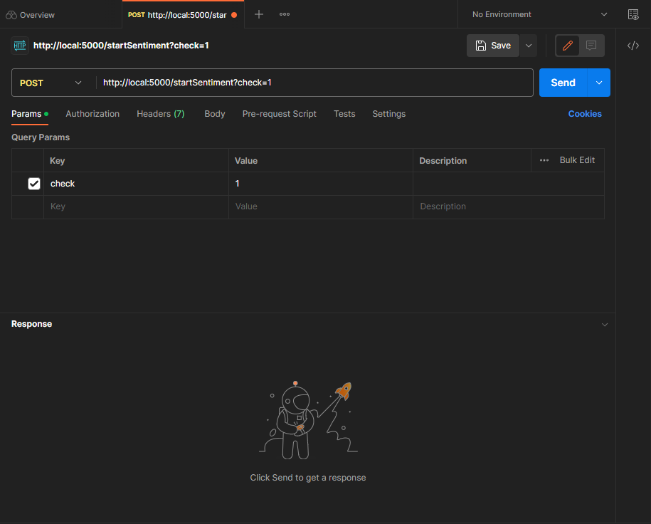

# flask_server 모델 사용방법
URL
      - 개인PC GPU(RTX 3060ti - 8GB)를 사용하여 KoBert 모델 파인튜닝하였고, 해당 KoBERT 모델을 로컬 환경에서 테스트 및 프로젝트를 진행하였습니다.
  
  <br><br><br>
## 환경 세팅
- os버전: windows 10, 11
- python 버전 : 3.8.5
- cuda 버전 : cuda 11.2 (GPU RTX 3060ti 8GB 기준)
- 기타 버전 설정

```bash
pip install kobert-transformers==0.4.1
pip install transformers==3.0.2
pip install tokenizers==0.8.1rc1
pip install torch==1.8.1+cu111 torchvision==0.9.1+cu111 torchaudio==0.8.1 -f https://download.pytorch.org/whl/torch_stable.html
```

<br><br><br>
## 라이브러리 설치

```powershell
pip install -r requirements.txt
```

설치가 너무 느리거나 오류 발생 시,

```powershell
pip install --upgrade -no-deps --force-reinstall -r requirements.txt
```
<br><br><br>

## 학습 방법
- 코드를 실행시키기 위해선, 모델 파일이 필요합니다.
- 프로젝트에 “checkpoint” 디렉토리를 만들고, [train.py](http://train.py) 에서

```python
		root_path = "."
    data_path = f"{root_path}/data/sentiment_human.txt"
    checkpoint_path = f"{root_path}/checkpoint"
    save_ckpt_path = f"{checkpoint_path}/kobert-sentiment-text-classification.pth"
```

save_ckpt_path에서 저장할 파일의 이름을 지정하면 됩니다.
<br><br><br>
## 학습 결과 이용방법
1. [application.py](http://application.py) 파일에서 학습하여 체크포인트 폴더에 저장된 pth파일의 경로를 불러옵니다.

```python
root_path = "."
checkpoint_path = f"{root_path}/checkpoint"
# train.py에서 학습시킨 checkpoint 파일 불러오기
save_ckpt_path = f"{checkpoint_path}/kobert-sentiment-text-classification.pth"

# 저장한 Checkpoint 불러오기
checkpoint = torch.load(save_ckpt_path, map_location=device)
```

2. 본 프로젝트는 flask서버를 local 환경으로 세팅했기 때문에, [application.py](http://application.py) 파일에서 host를 지정하여야합니다. 준비가 되었다면 application.py를 실행해줍니다.

```python
# 애플리케이션 실행
if __name__=="__main__":
    # application.run(debug=True)
    # host 등을 직접 지정할 수 있다.(본 프로젝트는 local로 진행하였다.)
    application.run(host="--", port="5000", debug=True)
```

3. 먼저 워드임베딩 진행 및 학습된 감정분석모델을 불러와야 합니다.
    
    개발된 API를 테스트하여 문서화 또는 공유할 수 있도록 하는 “Postman 플랫폼”을 이용하여, route경로 /startSentiment 에 POST방식으로 변수 check에 1 값을 request 해줍니다.
    
    [ postman 사진 ]
    </img>
    </img>
    
    postman에서 Response 값으로 1이 나왔다면 정상적으로 작동하고 있는 겁니다.
    

    <br><br><br>
    ## [ ※ 주의점 ※ ]
    
    ```python
    eb_data = pd.read_csv('./data/sentiment_human_final.csv', encoding='utf-8')
    model2 = SentenceTransformer('sentence-transformers/xlm-r-100langs-bert-base-nli-stsb-mean-tokens')
    model = KoBERTforSequenceClassfication()
    ctx = "cuda" if torch.cuda.is_available() else "cpu"
    device = torch.device(ctx)
    ```
    
    - 워드임베딩 진행시 eb_data 변수에 임베딩을 진행할 데이터셋 파일이 필요합니다.
    - 데이터의 양과 gpu성능에 따라 워드임베딩 되는 시간이 달라집니다.
    - 본 프로젝트는 gpu rtx3060ti 를 사용하였고, 169211 개의 데이터를 사용하여 워드임베딩을 진행했으며, 그 결과 40분 정도 시간을 소요하였습니다.
  
  <br><br>
    
1. 기본 작업은 다 끝났고 node 서버의 “플라스크 로컬 통신” 부분의 url 부분을 자신의 로컬 ip로 맞춰주면 정상적으로 flask와 통신이 가능합니다.

  - 최종 통신 방법
      - 클라이언트(input) → node 서버 → flask 서버 → node 서버 → 클라이언트(output)
